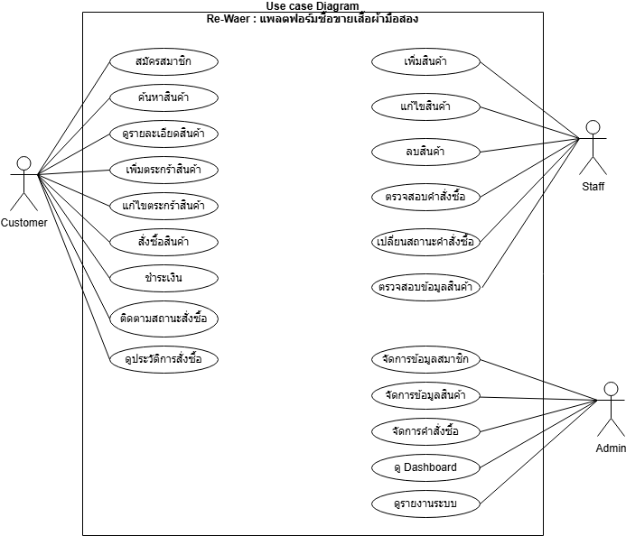
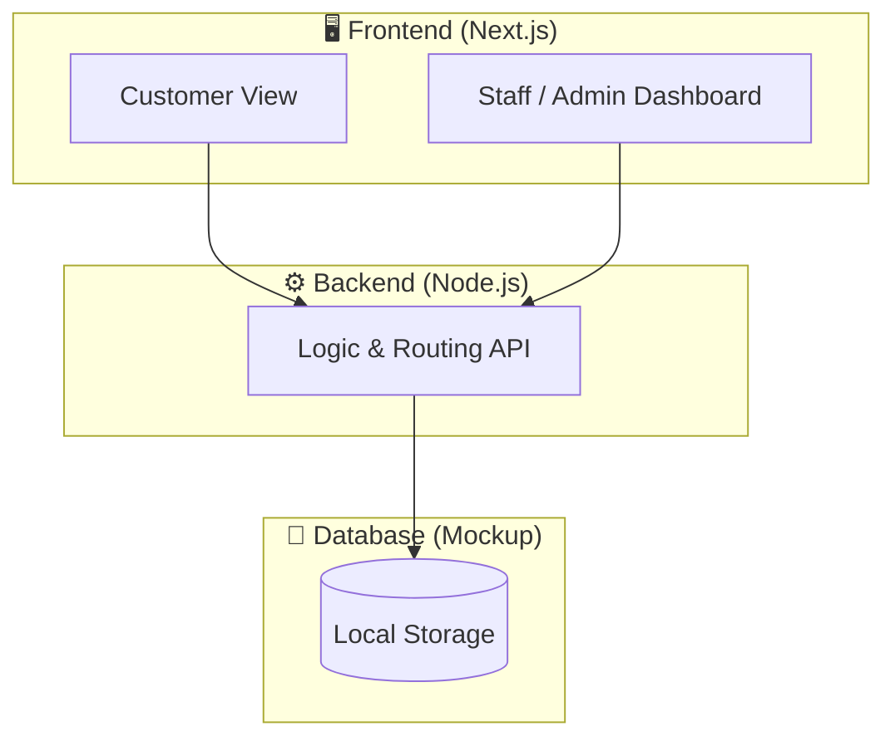
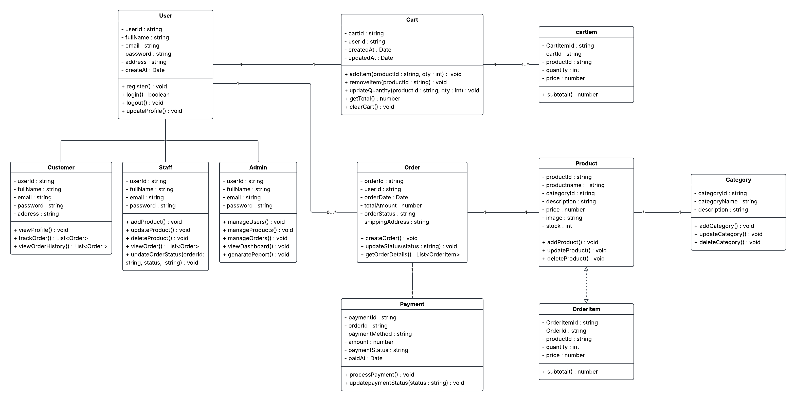
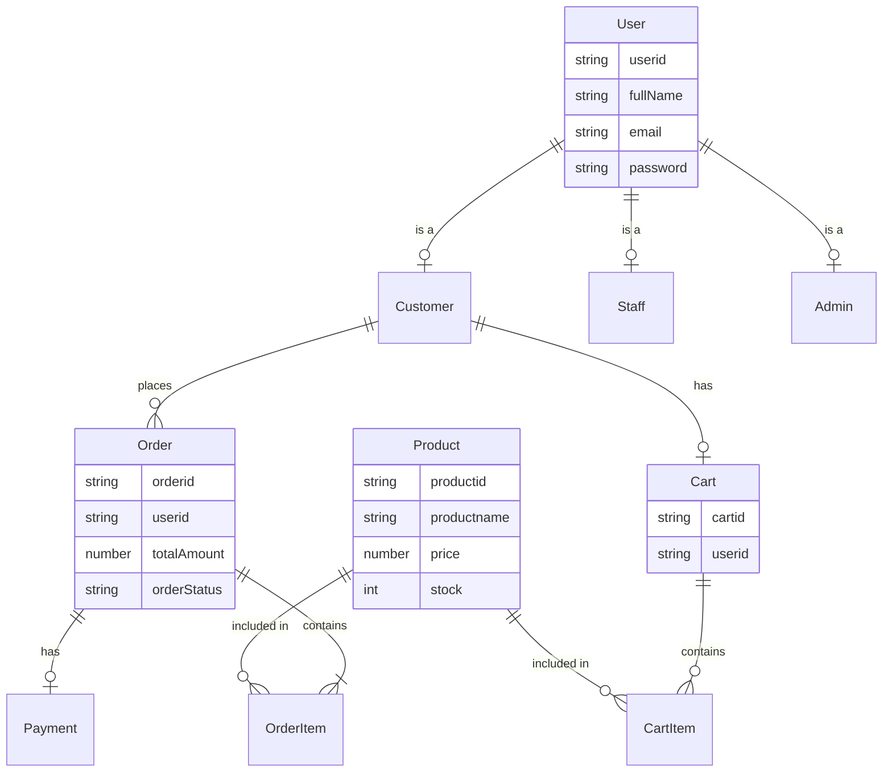
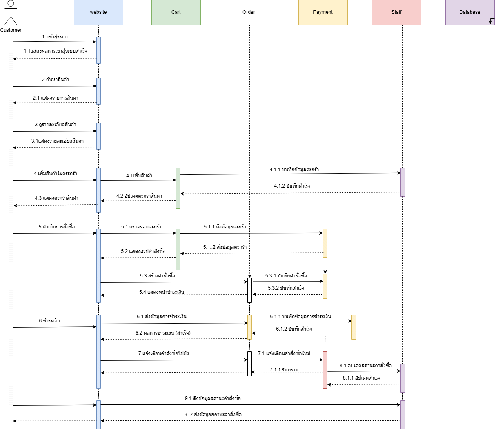

# 📊 เอกสาร Analysis & Design

## 📑 สารบัญ (Table of Contents)
- [1. ภาพรวมระบบ (System Overview)](#1-ภาพรวมระบบ-system-overview)
- [2. ความต้องการของระบบ (Requirement Analysis)](#2-ความต้องการของระบบ-requirement-analysis)
  - [2.1 Functional Requirements](#21-functional-requirements)
  - [2.2 Non-Functional Requirements (SLA Targets)](#22-non-functional-requirements-sla-targets)
  - [2.3 Use Case Diagram](#23-use-case-diagram)
- [3. การจำลองกลุ่มผู้ใช้งาน (Persona Design)](#3-การจำลองกลุ่มผู้ใช้งาน-persona-design)
- [4. สถาปัตยกรรมระบบ (System Architecture)](#4-สถาปัตยกรรมระบบ-system-architecture)
- [5. โครงสร้างฐานข้อมูล (Database Design)](#5-โครงสร้างฐานข้อมูล-database-design)
  - [5.1 Data Schema (LocalStorage JSON)](#51-data-schema-localstorage-json)
  - [5.2 Class Diagram](#52-class-diagram)
  - [5.3 Mermaid ER Diagram](#53-mermaid-er-diagram)
- [6. Flow การทำงานหลัก (Sequence)](#6-flow-การทำงานหลัก-sequence)
  - [6.1 Sequence Diagram](#61-sequence-diagram)
- [7. หลักการออกแบบที่นำมาใช้ (Design Principles)](#7-หลักการออกแบบที่นำมาใช้-design-principles)

---

## 1. ภาพรวมระบบ (System Overview)

ระบบ Re-wear เป็นแพลตฟอร์ม e-Commerce สำหรับส่งต่อเสื้อผ้ามือสอง โดยมีผู้ใช้งานหลัก 3 กลุ่มคือ
ลูกค้า (Customer), พนักงาน (Staff) และ ผู้ดูแลระบบ (Administrator)

---

## 2. ความต้องการของระบบ (Requirement Analysis)

### 2.1 Functional Requirements

| รหัส | รายการ | รายละเอียด | ความสำคัญ |
|---|---|---|---|
| F-01 | สมัครสมาชิก | ลูกค้าสามารถสมัครสมาชิกเพื่อเข้าใช้งาน | High |
| F-02 | ค้นหาและดูสินค้า | ลูกค้าสามารถค้นหาและดูรายละเอียดเสื้อผ้า | High |
| F-03 | จัดการตะกร้าสินค้า | ลูกค้าสามารถเพิ่ม แก้ไข ลบสินค้าในตะกร้า | High |
| F-04 | สั่งซื้อและชำระเงิน | ลูกค้าสามารถสั่งซื้อ ติดตามสถานะ และดูประวัติ | High |
| F-05 | จัดการสต็อกสินค้า | พนักงานสามารถเพิ่ม แก้ไข ลบ และตรวจสอบสินค้า | High |
| F-06 | จัดการคำสั่งซื้อ | พนักงานสามารถตรวจสอบและเปลี่ยนสถานะคำสั่งซื้อ | High |
| F-07 | Dashboard ผู้ดูแล | ผู้ดูแลระบบสามารถดูภาพรวมและรายงานระบบ | Medium |
| F-08 | จัดการผู้ใช้งาน | ผู้ดูแลระบบสามารถจัดการข้อมูลสมาชิกและสิทธิ์พนักงาน | High |

### 2.2 Non-Functional Requirements (SLA Targets)

- **Availability**: ความพร้อมใช้งานระบบ 99.5%
- **Backup**: สำรองข้อมูลใน Local Storage
- **Support Hours**: จันทร์ - ศุกร์ เวลา 08:30 - 17:30 น.
- **Incident Response**: การตอบสนองและแก้ไขปัญหาตามระดับ Severity (1-3)

### 2.3 Use Case Diagram


---

## 3. การจำลองกลุ่มผู้ใช้งาน (Persona Design)

### 3.1 👧 Persona 1: Customer (ลูกค้า)
- **ชื่อ:** ฟ้าใส สายรักษ์โลก (อายุ 22 ปี, นักศึกษา)
- **Bio:** ชื่นชอบการแต่งตัวและแฟชั่นวินเทจ ใส่ใจสิ่งแวดล้อม ชอบซื้อเสื้อผ้ามือสองเพราะราคาถูกและมีสไตล์ไม่ซ้ำใคร
- **Goals:** ต้องการแพลตฟอร์มที่ค้นหาเสื้อผ้ามือสองสภาพดีได้ง่าย, ขั้นตอนสั่งซื้อไม่ซับซ้อน, ติดตามสถานะของได้
- **Pain Points:** ร้านทั่วไปรายละเอียดสินค้าไม่ชัดเจน, สั่งซื้อยุ่งยาก
- **Scenario:** ฟ้าใสเข้ามาหาเสื้อแจ็คเก็ตมือสอง ค้นหาเจอ หยิบลงตะกร้า สั่งซื้อ ชำระเงิน และติดตามสถานะ

### 3.2 👨💼 Persona 2: Staff (พนักงาน)
- **ชื่อ:** ก้องเกียรติ ขยันทำงาน (อายุ 26 ปี, พนักงานดูแลร้าน)
- **Bio:** รับหน้าที่จัดการออเดอร์ อัปเดตสต็อก และดูแลความเรียบร้อยของสินค้า
- **Goals:** อัปเดตสถานะสินค้าและคำสั่งซื้อได้อย่างรวดเร็ว, ตรวจสอบการชำระเงินได้ง่าย
- **Pain Points:** ระบบจัดการออเดอร์หลายขั้นตอนทำให้ล่าช้า
- **Scenario:** ก้องเกียรติล็อกอินเข้าระบบ ตรวจสอบคำสั่งซื้อใหม่ ยืนยันการชำระเงิน และอัปเดตสถานะจัดส่ง

### 3.3 👑 Persona 3: Administrator (ผู้ดูแลระบบ)
- **ชื่อ:** วีระ ผู้จัดการ (อายุ 34 ปี, ผู้ดูแลระบบ)
- **Bio:** ต้องการให้ระบบทำงานเสถียรและติดตามยอดขายได้
- **Goals:** ดูภาพรวมของระบบผ่าน Dashboard, จัดการสิทธิ์พนักงาน
- **Pain Points:** ขาดสรุปข้อมูลยอดขายที่ดูง่าย
- **Scenario:** วีระเข้าสู่ Dashboard ดูสถิติยอดขาย จัดการสิทธิ์การเข้าถึงของ Staff

---

## 4. สถาปัตยกรรมระบบ (System Architecture)

ระบบออกแบบตามแนวคิดที่เน้นการพัฒนาได้อย่างรวดเร็ว
แบ่งออกเป็น Frontend (Next.js), Backend (Node.js) และฐานข้อมูลชั่วคราว (Local Storage)



---

## 5. โครงสร้างฐานข้อมูล (Database Design)

### 5.1 Data Schema (LocalStorage JSON)

ระบบจัดเก็บข้อมูลใน LocalStorage เพื่อใช้เป็นตัวอย่างสาธิต โดยมีโครงสร้างดังนี้:

```json
{
  "users": [
    { "id": "U01", "role": "customer", "name": "ฟ้าใส", "email": "fah@email.com" },
    { "id": "S01", "role": "staff", "name": "ก้องเกียรติ", "email": "staff@email.com" }
  ],
  "products": [
    { "id": "P01", "name": "Vintage Denim Jacket", "price": 450, "stock": 1, "status": "Available" }
  ],
  "orders": [
    { "id": "O01", "customerId": "U01", "status": "Pending", "totalAmount": 450 }
  ]
}
```

### 5.2 Class Diagram


### 5.3 Mermaid ER Diagram


---

## 6. Flow การทำงานหลัก (Sequence)

### 6.1 Sequence Diagram


---

## 7. หลักการออกแบบที่นำมาใช้ (Design Principles)

- **Separation of Concerns**: แยกส่วน Frontend (Next.js) และ Backend (Node.js) อย่างชัดเจน
- **Single Responsibility**: แบ่งหน้าที่ของผู้ดูแลระบบ, พนักงาน, และลูกค้า เพื่อจัดการข้อมูลอย่างเป็นระบบและลดความซ้ำซ้อน
- **Rapid Prototyping (ตาม SDLC)**: เลือกใช้ Local Storage แทนการตั้งค่าฐานข้อมูลจริง เพื่อความรวดเร็วในการพัฒนาต้นแบบและสาธิตการทำงานตามกรอบเวลา

---

## 8. สรุป (Conclusion)

> 📌 **Note:** เอกสารนี้แสดงการวิเคราะห์และออกแบบระบบเบื้องต้น ซึ่งจะถูกนำไปใช้เป็นแนวทางในการพัฒนา
ระบบจริงในขั้นตอนถัดไป
